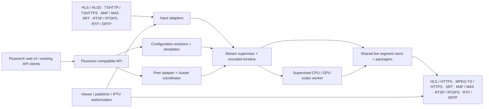

# FlussoniX architecture

Design v0.3 · 2026-09-14 HST / 2026-09-15 UTC

## Product decision

Build a standalone media server whose public behavior can replace a pinned Flussonic version. Preserve existing management integrations, media URL conventions and authorization integrations. The first release includes Streams, Templates, Config, Cluster, all requested protocols and CPU/GPU transcoding. Full Flussonic functionality is a longer-term objective; each implemented feature needs observable acceptance criteria.

Use **26.04.1** as the initial reference profile: both the local package and the supplied functionality demo report that version. The online API schema is a separate reference revision. The demo's workload does not determine migration scope, sizing or supported hardware.

## Language and dependencies

| Choice | Strength | Cost / decision |
|---|---|---|
| **Rust core — recommended** | Explicit buffer ownership, no tracing garbage collector, native protocol parsing, reusable immutable payloads | Build supervision, cancellation and admission control deliberately; native library boundaries need isolation |
| Erlang/OTP core | Excellent supervision and concurrent state machines; reference-counted binaries | Still requires native codec integrations; a strong option if the implementation team is substantially more productive in OTP |
| Go core | Fast development, operational simplicity, mature networking | Media allocation and garbage-collection behavior need careful benchmarking; no inherent throughput guarantee |
| C++ core | Direct access to codec and transport libraries | Larger memory-safety and maintenance burden for a new network service |

This is an engineering recommendation, not a measured claim that Rust is faster than Flussonic. Erlang already shares large binaries efficiently. [Erlang binary handling](https://www.erlang.org/doc/system/binaryhandling.html)

Use Tokio for network scheduling, Axum/Hyper for HTTP, Serde for typed internal data, and shared immutable byte buffers for encoded media. Keep compatibility routing separate from framework defaults, especially URL decoding and errors. CPU work and blocking codecs belong outside network executor threads. [Axum](https://docs.rs/axum/latest/axum/), [Tokio shared state](https://tokio.rs/tokio/tutorial/shared-state), [Tokio scheduling](https://tokio.rs/blog/2020-04-preemption)

Integrate libsrt through a narrow adapter. Use FFmpeg libraries inside supervised worker processes for decoding, filtering and encoding; the FFmpeg CLI is useful for initial fixtures and an early worker prototype. It must not become an implicit second stream manager. Pin tested library/driver combinations during implementation. [libsrt](https://github.com/Haivision/srt), [libavcodec](https://ffmpeg.org/libavcodec.html)

## Process and data flow

Start with one Rust daemon per node and separate codec workers. Within the daemon, independently supervised stream tasks own mutable stream state; registries are sharded. Scale across nodes before introducing unnecessary services.

The control plane owns configuration, templates, revisions, resource scheduling and compatibility serialization. The media plane owns input connections, clocks, frames, packaging, payload retention and fan-out. Established media delivery performs no synchronous configuration database or consensus operation per frame or segment.

Proposed workspace boundaries:

| Module | Responsibility |
|---|---|
| `compat-api` | Reference-version routing, request merge semantics, response projections, pagination and errors |
| `config` | Flussonic text parser, typed desired state, template expansion, validation and atomic revisions |
| `media-core` | Track metadata, clocks, discontinuities, stream supervisors, shared encoded buffers |
| `protocol-hls`, `protocol-tshttp`, `protocol-srt` | Ingest, publish/push and delivery adapters with independent state machines |
| `protocol-rtsp` | RTSP/RTSPS client and server roles: pull, incoming publication, playback and push |
| `protocol-rtp`, `protocol-srtp` | RTP/RTCP receive/transmit, packetization, jitter/clock handling and SRTP/SRTCP protection |
| `compat-m4f`, `compat-m4s` | Flussonic wire interoperability; opaque payload retention and parsed media views |
| `auth` | Management credentials, playback/publish sessions, callbacks, configured backends and IPTV |
| `transcode`, `codec-worker` | Validated codec plans, process supervision, CPU/GPU capability and resource reservations |
| `cluster` | Legacy peer/source adapter, stream directory, LB/CDN/source roles, native placement and ownership |
| `load-balancer` | Legacy modes plus adaptive uplink/CPU/RAM selection, content readiness, affinity and edge admission reservations |
| `observability` | Statistics snapshots, bounded event queues, logs and metrics |
| `web` | Independently implemented administration UI consuming the compatibility API |

RTSP/RTSPS and RTP/SRTP are first-release requirements in both inbound and outbound directions. The [transport contract](rtsp-rtp-support.md) defines client/server roles, direct media flows, keying and reference-version boundaries. Use libsrtp for the SRTP/SRTCP adapter; control-session TLS and media protection remain explicit settings.

## Encoded media model

Each stream owns a generation and a timeline. Each encoded access unit carries track identity, codec configuration revision, DTS, PTS, duration, keyframe status, rational timescale, payload reference and optional UTC association. Use checked integer arithmetic; avoid floating-point timestamp accumulation.

Preserve source timestamps and source segment identity when ingesting M4F/M4S. Track wall-clock mapping separately from monotonic scheduling clocks. Clock corrections, input reconnection, codec configuration changes and timestamp resets create explicit discontinuities. Track IDs and codec configuration changes must propagate to every output.

A retained segment has stream generation, source epoch, sequence, time range, codec revision, track selection and immutable payload references. Segment cache keys also distinguish output container, encryption state and any session-specific media processing. Authorization occurs before delivery even when media bytes are shared.

For M4F pass-through, retain the original bytes alongside decoded metadata. Regenerating an equivalent MP4 object can break the reference's byte-identity expectations. When transcoding, assign a new generation and segment identity; do not promise identity with the source.

## Performance and overload

One upstream connection per active stream/source, shared across viewers. Package once per stream/track/container combination. Allocate payloads by segment or bounded chunk and share references; do not copy full frames per viewer.

Bound retained media, pending HTTP writes, transport queues, codec work and per-stream subscribers by both bytes and time. Slow consumers must not indefinitely pin old segments or stall all viewers. Recover at a valid keyframe/segment boundary or disconnect the individual consumer according to the transport contract.

Share encoded payloads across RTP consumers while keeping packet sequence, SSRC and SRTP key/index state per transport context. Protected output and mutable packet headers are generated for the relevant session; include that per-session cost in fan-out sizing.

Admission considers CPU, RAM, sustained NIC bandwidth, disk bandwidth, GPU surfaces and encoder sessions. Separate packet handling, packaging and codec metrics. Per-stream restarts use bounded backoff and jitter. Avoid spawning an FFmpeg process per viewer.

Capacity must be measured on named hardware. Illustrative arithmetic, **not promised capacity**:

- 500 streams × 6 Mbit/s × 12 seconds / 8 = 4.5 GB of encoded live buffering before metadata and alternate containers.
- 10,000 viewers × 6 Mbit/s = 60 Gbit/s of payload egress before transport overhead.
- A provisional admission ceiling of 70% of a 10-Gbit/s link is about 1,166 such viewers, before CPU and protocol constraints.

Benchmark all-streams-active load separately from on-demand definitions. Establish CPU/GPU transcode capacity using codec, resolution, frame rate, bit depth, filters and output ladder; a stream count alone is inadequate.

## CPU and GPU transcoding

Compile Flussonic-style `transcoder` objects into a typed pipeline plan: decode → filter/scale → one or more encodes, with audio processing or passthrough. Include AAC audio conversion, sample-rate/channel handling and volume settings, plus H.264/H.265 video, scaling, frame rate, bitrate controls, GOP/keyframe alignment and multibitrate ladders.

The first release requires working CPU video/audio processing and a validated GPU backend. Implement NVIDIA NVDEC/NVENC first as the proposed initial GPU target. Keep an adapter boundary for Intel QSV/VAAPI and AMD/VAAPI; additional GPU families become supported only after hardware-specific tests. Actual deployment GPU requirements remain open.

A worker owns its decode/filter/encode graph. Keep decoded surfaces on the GPU where possible, and reuse decoded frames across renditions. FFmpeg supports this NVIDIA pipeline. [NVIDIA FFmpeg integration](https://docs.nvidia.com/video-technologies/video-codec-sdk/13.0/ffmpeg-with-nvidia-gpu/index.html)

Reserve codec resources before activating configuration. Monitor encode speed, output frame rate, queue delay, device resets and allocation failures. Restart only the affected pipeline. GPU-to-CPU fallback requires an explicit policy and CPU capacity reservation; otherwise report resource exhaustion. Preserve audio/video synchronization through worker restart. Equal output settings do not imply bit-identical encoding across implementations.

## Configuration and supervision

Store explicit configuration separately from its effective expansion and runtime statistics. Preserve absent/null/value distinctions in requests. Configuration follows parse → validate → derive effective state → plan resources → commit durable revision → reconcile.

Use a local transactional store for standalone operation, with a durable export of Flussonic-style text. Support text parsing, templates, partial updates, reset, defaults and unknown-field diagnostics. Native FlussoniX settings live outside the reference API namespace. API success codes and when changes become visible follow the version profile, not an invented asynchronous contract.

Persist the desired revision before reporting durable success. Expose runtime failures accurately if upstream connection or codec startup subsequently fails. Reconfiguration restarts only affected pipelines when possible. Retain a last-known-good revision for operator rollback.

## Cluster design

The required topology is **viewer → LB redirect → CDN → source over LAN**. A CDN reuses a fresh local stream or starts one shared upstream subscription. Sources, CDN nodes and balancers are distinct roles; management, public delivery and private media addresses are configured separately. See the [cluster and load-balancing design](cluster-loadbalancing.md) for the full request flow, Flussonic source semantics and failure policy.

Keep legacy balancing modes intact. The recommended native policy excludes nodes without capacity or a usable stream route, compares projected uplink/CPU/RAM pressure, prefers ready media among similarly loaded candidates and reserves admission on the selected edge before redirecting. One LB is supported; a second LB is an optional availability improvement. Simple redirect routing has no mandatory etcd dependency.

Support both **FlussoniX-only** and **mixed Flussonic/FlussoniX** topologies. Mixed operation is a required design target; each peer role and direction must be validated before being advertised.

The reference adapter handles sources, peers, stream discovery, static/on-demand propagation, filtering, precedence, cluster authentication, payload transport and legacy balancing behavior. Separate explicit M4F input support from cluster discovery: one does not establish the other.

For FlussoniX-only operation, use an optional three-member etcd control store for versioned configuration, placement leases and ownership epochs. Standalone nodes have no etcd dependency. Consensus coordinates ownership and durable state; cached routing and media delivery remain local. [etcd API guarantees](https://etcd.io/docs/v3.6/learning/api_guarantees/)

Assign each native ingest owner a monotonically increasing epoch. Enforce fencing at participating publishers, registries and writers; a lease alone cannot fence external systems. A node losing its ownership lease must stop acting as authoritative owner. Unmanaged legacy peers do not participate in native fencing: give each stream an explicit authority during mixed operation.

Failover has separate policies for source pull, ingest ownership, codec placement and viewer routing. Promote only after checking media freshness and usable codec configuration. Preserve timelines when replicated segments permit it; otherwise signal discontinuity and measure the recovery gap. Existing TCP/SRT/RTSP sessions cannot simply be moved to another host.

On quorum loss, reject native ownership/config changes and retain cached configuration. Existing valid delivery can continue within its ownership and authorization rules. Shared maximum-session enforcement needs a strongly consistent reservation service on session admission; purely eventual counters cannot guarantee a global limit. High-rate counters and telemetry remain outside consensus.

## Open product decisions

Peak active streams/viewers, bitrate distribution, deployment hardware, GPU families, required Flussonic versions, detailed SRT modes, and DVR requirements will be set using the actual target environment. None prevents starting the architecture or first implementation gates. Full DVR storage, RTMP, WebRTC, DASH, DRM and hardware broadcast interfaces remain explicit later work unless the user reprioritizes them.
