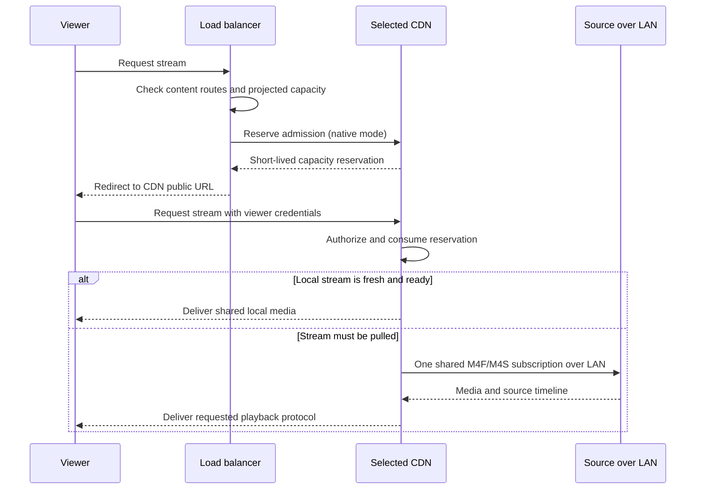

# Cluster and load balancing

Full-product design and first-release requirements. Selected native routing/source paths and configured-input recovery are implemented in the preview; full legacy interoperability and failure/scale gates remain open.

The real-daemon native TLS recovery profile uses two equivalent origins, a CDN
and an LB, each with an independent trusted test CA and HTTPS-only listener.
The ordinary CPU regression runs with `cargo test --locked --test
cluster_native_recovery`. On a host with the independently installed Intel
H.264 VAAPI driver and `/dev/dri/renderD128`, run the hardware cases with:

```sh
cargo test --locked --test cluster_native_recovery -- --ignored --nocapture --test-threads=1
```

Origins use the same content identity, source group and viewer-token policy,
with distinct peer keys. The primary origin is stopped after protected playback
through an LB ticket. Until automatic source switching produces a fresh CDN
generation, the harness makes only read-only node telemetry requests. It never
calls reconciliation or makes a new media request to stimulate recovery.
Both native routes use verified TLS: M4SS and M4FS are selected from secure
source endpoints. Encoding stays at the origin; CDN worker arguments must use
codec copy. Protected before/after HLS segments undergo independent strict
audio/video decoding. Reload/concurrent requests share the CDN worker, anonymous
playlists/segments remain denied, and admission tickets cannot be replayed.

Set `FLUSSONIX_CLUSTER_RECOVERY_EVIDENCE_DIR` to a local directory to retain
JSON reports containing origin/CDN process arguments, loaded Intel driver
hashes, decoder frame counts and recovery observation time. Timing starts when
the harness requests primary-origin shutdown and ends after a replacement CDN
PID has received over 250kB and published a playlist from a different generation.
It excludes subsequent offline decoding. This loopback synthetic-source profile
is a functional qualification, not a first-frame SLA, seamless playback,
hardware decoding, HEVC GPU encoding, WAN/soak or capacity benchmark.

## Repeated native TLS origin failover

The repeated-failure scenario adds an A → B → A sequence to the same owned
four-daemon profile. After the first automatic switch, A is restored at its
original HTTPS address with unchanged configuration and trust. For 16 seconds,
read-only observations require B's CDN PID and media generation to remain stable,
input bytes to advance, and A to remain an idle standby. Restoring the preferred
origin must not interrupt a healthy fallback.

Actual playback refreshes demand before the next fault. The harness verifies B
is still selected, stops B and its encoder, then makes no playback request until
read-only observations prove a second automatic source switch to A, a replacement
CDN PID, over 250kB of fresh input and a third distinct playlist generation.
Protected HTTP playlist and segment bytes are bound to each observed generation
before independent strict video/audio decode. Each active CDN generation copies
codecs, the LB never encodes, retired PIDs are absent, concurrent viewers share
the replacement, tickets reject replay and anonymous media remains denied.
Saved configuration must stay byte-for-byte unchanged.

```sh
# Ordinary CPU profile (also runs in normal CI).
cargo test --locked --test cluster_native_recovery daemon_retains_healthy_fallback_then_recovers_a_second_origin_failure -- --exact --nocapture --test-threads=1
# Opt-in Intel H.264 VAAPI profiles over verified M4SS and M4FS.
cargo test --locked --test cluster_native_recovery repeated_gpu_origin_failures -- --ignored --nocapture --test-threads=1
```

Set `FLUSSONIX_CLUSTER_RECOVERY_EVIDENCE_DIR` as above for the `*-repeated.json`
reports. They retain both fault-to-fresh-generation observations, the healthy
fallback observation and decode/process evidence for all three generations.
The second interval starts at fallback shutdown; it excludes the preceding
standby-restoration observation and subsequent decoding. These bounded loopback
checks do not establish long-duration stability, gapless playback, arbitrary
fault sequences, forced failback to a healthy preferred node or production
capacity. No vendor component participates.

## HEVC and MPEG-audio native TLS recovery

The same four owned HTTPS-only daemons also exercise CPU `libx265` origins
with Layer II (`mp2a`, 192 kb/s) or MP3 (`mp3`, 128 kb/s), at 640×360/25 fps
and 48 kHz audio. Each combination runs over both verified M4SS and M4FS
source routes. The CDN copies video and audio; the LB starts no encoder.
The initial and replacement HLS MPEG-TS outputs must retain HEVC and the
requested MPEG audio layer, contain changing decoded video/audio, and pass
strict independent FFmpeg decoding. HTTP bytes remain bound to the observed
generation's completed segment. Protected CDN M4S metadata must also retain
`hevc` plus `m2a` or `mp3`, including when its upstream transport is M4FS.

These four cases run in ordinary CI without a GPU or vendor component:

```sh
cargo test --locked --test cluster_native_recovery daemon_recovers_hevc_ -- --nocapture --test-threads=1
```

The existing authorization, TLS trust, ticket replay, shared-worker, automatic
source-switch, retired-process and unchanged-configuration checks apply.
Recovery observation makes no playback requests. Native metadata inspection
occurs only alongside actual playback, before the fault or after read-only
observation has established a fresh replacement generation. Evidence uses
`libx265-mp2a-m4s.json`, `libx265-mp2a-m4f.json`, `libx265-mp3-m4s.json` and
`libx265-mp3-m4f.json` under `FLUSSONIX_CLUSTER_RECOVERY_EVIDENCE_DIR`.

This profile qualifies a single equivalent-origin failover and native codec
retention, not browser HEVC/MPEG-audio support, HEVC GPU encoding, Main10,
parameter-set changes, multiple audio tracks, mixed-vendor interoperability,
gapless delivery or sustained capacity. The repeated-failure and blackout
profiles above retain their separately stated H.264/AAC coverage.

The implemented [native pressure profile](native-cluster-pressure.md) shares
HTTP/RTSP ranking by maximum normalized uplink/CPU/RAM pressure, bounded ready
preference, actual reserved Mbps and the existing CDN-owned admission ledger.
The broader policy below remains the full-product design, including resource
cost models and configurable margins that are not yet implemented.

## Required topology

The user's deployment has one load balancer, several CDN delivery nodes, and servers that hold or ingest streams. The LB receives a viewer request, selects a CDN using uplink saturation, CPU and RAM, and redirects the viewer. The selected CDN serves an already-running local stream or pulls it from an appropriate source over the local network.

Preserve this topology. One server may perform multiple roles, but roles remain explicit:

| Role | Responsibility |
|---|---|
| Load balancer (LB) | Select an eligible delivery node and return the protocol-appropriate routing result |
| CDN / edge | Authorize and serve viewers; share local media and pull missing streams on demand |
| Source / origin | Ingest, receive publication, transcode or otherwise supply the authoritative stream |
| Peer | Registered server identity, capabilities, addresses and telemetry; it can serve one or more roles |

A stream source in cluster configuration is an upstream media server relationship. It is distinct from a camera/input URL and from a balancer's delivery pool. A transcoder can also be a source, and different streams can have different origins.



The reservation is a FlussoniX internal design choice. A compatibility route to a legacy CDN does not assume it supports this RPC.

## Flussonic reference behavior

Flussonic `source` discovers streams from an upstream server and supports static/on-demand restreaming. Its source filters have specific behavior: `except` takes priority; `only` promotes selected streams to static while others can remain on demand. Locally configured or published streams take precedence over remote names. Multiple sources can provide alternatives. M4F is the documented default inter-server transport. Preserve these semantics in the compatibility profile. [Cluster restreaming](https://flussonic.com/doc/fms/cluster/restreaming/)

The documented LB redirects requests and has four modes: `bitrate` (absolute output), `usage` (output relative to configured capacity), `clients` and `streams`. Its documented redirect scope is HTTP-based playback/publication, not every media transport. [Load balancing](https://flussonic.com/doc/fms/cluster/loadbalancer/)

The local 26.04.1 schema additionally distinguishes `api_url`, `public_payload_url` and `private_payload_url`. It exposes source groups, per-peer CPU limits and telemetry including CPU/memory percentages. This metadata does not establish a combined CPU/RAM selection formula in the legacy balancer.

Static inspection of `balancer`, `cluster_source` and `cluster_peer` confirms separate routing and source-resolution modules. The balancer has mode-based ranking, candidate/content filtering, maximum-bitrate checks and client-affinity state. The source resolver has candidate and prefix lookup operations. Full call-path semantics, redirect format and fallback behavior remain reference-test requirements.

## Address and content model

Every node has separately configured management, public delivery and private media endpoints. Viewer redirects use public endpoints; CDN-to-source subscriptions use private endpoints. Private-only source nodes are never accidental viewer destinations. If the topology requires LAN transport and no private route is usable, return an explicit routing failure rather than silently fetching over a paid public uplink.

Map native per-protocol listeners beneath each node identity; do not force SRT or RTP addresses into an HTTP URL. Mirror the reference's public/private/API fallback rules only in compatibility mode; native mode validates explicit role addresses.

Maintain two views:

1. **Source directory:** canonical stream name → configured origin candidates, authority, origin epoch, media/config revision, codecs, private endpoints and source availability.
2. **CDN availability:** node × stream → absent, discoverable, starting, ready, stale or failed; include upstream, revision and media freshness.

A configured stream is not necessarily running. A last cached segment does not establish readiness for live playback. A CDN can be eligible if it is ready locally **or** has a permitted, reachable source route and capacity to start it.

Advertise snapshots and sequenced changes. Detect missed updates, refresh the snapshot and expire stale observations. Legacy adapters poll supported APIs with bounded concurrency. An LB request uses cached views; it does not query every source for every viewer.

Prevent CDN-to-CDN pull cycles using explicit upstream relationships and route ancestry. The baseline is direct CDN-to-source transport. Optional regional relays need their own loop-free topology and resource budgets. Native origin-ownership epochs remain separate from CDN subscriptions: several CDNs may legitimately pull the same stream.

## Proposed selection policy

Provide two distinct configurations:

- **Reference compatibility:** preserve the selected Flussonic mode and its observable semantics, including limit/unit behavior and affinity.
- **Native adaptive selection — recommended:** account for uplink saturation, CPU, memory, content readiness and pending admissions. This is a FlussoniX extension; do not add an unsupported mode value to the legacy API.

The adaptive policy has the following sequence.

### 1. Exclude ineligible nodes

Exclude unhealthy, draining or stale nodes; nodes lacking the requested playback/codec capability; nodes without a valid local stream or source route; and nodes whose projected resource use would exceed a configured safe budget.

Capacity checks include public egress, relevant LAN ingress/egress, CPU, memory headroom and any required decoder/encoder capacity. A low CPU percentage cannot compensate for a saturated uplink.

Treat missing capacity/telemetry as unknown, not zero load. Configure conservative fallback limits for a legacy node or exclude it from adaptive routing. Readiness must include media freshness and upstream reachability, not just an HTTP health response.

### 2. Compute normalized projected pressure

For each applicable resource, compute the projected use divided by its configured safe budget. Define node pressure as the maximum of these ratios:

```text
projected resource use =
    current observed use
  + accepted work not yet represented by telemetry
  + estimated cost of this request

node pressure = max(
    public egress pressure,
    CPU pressure,
    memory pressure,
    relevant LAN pressure,
    required codec resource pressure
)
```

Count each physical bottleneck once. If public and private traffic share a NIC, bond member, uplink or switch bottleneck, account for combined traffic and directional capacity there. If they are independent, keep their budgets separate. Do not equate the sum of configured stream bitrates with actual uplink use.

Uplink capacity is configured usable capacity, capped by the physical link and operator policy. Native telemetry measures the actual delivery interface and shared bottlenecks. Use recent rate plus a smoothed trend and reservations so smoothing does not hide a sudden burst.

Memory pressure is based on available headroom, worker working sets and outstanding allocations; do not mark a node full merely because reclaimable filesystem cache is large. Legacy aggregate memory percentages need a documented fallback because they may not provide that detail.

The incremental cost includes viewer bitrate/packaging/encryption and, for a cold stream, its one-time upstream pull, live buffer and any codec pipeline. For ABR, reserve a conservative allowed rendition estimate, then reconcile with observed use and policy limits.

**Example:** CDN A sends 8 Gbit/s over a 10-Gbit/s uplink; CDN B sends 12 Gbit/s over a 40-Gbit/s uplink. Their link utilizations are 80% and 30%. Assuming other resource checks pass, B has more delivery headroom despite its larger absolute output. The safe operating ceilings may exclude A entirely.

### 3. Prefer existing media among similarly loaded candidates

Shortlist nodes within a configurable pressure margin of the best candidate; an initial experimental margin is 0.05. Within that set, prefer a fresh ready stream, then a stream already starting, then a cold pull. Use a stable session-based tie break or randomized choice among equivalent candidates.

Hard limits always apply. Locality preference must not trap a popular stream on an overloaded CDN. As its pressure rises, new viewers spill onto another CDN, which starts one additional source subscription.

Keep existing viewers on their chosen CDN. Reconsider placement for new sessions, genuine failure or an explicit drain policy; changing a score does not move an established connection.

### 4. Reserve and recheck admission

For native CDNs, the LB obtains a short-lived, idempotent admission reservation before redirecting. The edge owns the final reservation ledger, so multiple LBs cannot independently spend the same reported headroom. Rejection triggers a bounded retry on another candidate.

Reservation lifecycle: pending → consumed by viewer admission → reconciled into measured active load, or expired/cancelled. Link reservations to node boot identity and configuration epoch; do not count already-measured sessions a second time. Separate stream-start reservations so concurrent first viewers reserve one upstream/codec pipeline, not one each.

The LB reservation does not grant content access and does not start an unauthenticated source pull. The edge checks viewer authorization before attaching to media. Lost redirects or clients that never arrive release their pending capacity automatically.

Legacy nodes cannot enforce the native reservation protocol. Use conservative per-LB estimates, headroom, admission rate limits and the reference's actual behavior; document that these estimates cannot provide strict cross-LB capacity guarantees.

## Pulling from source servers

After authorization, the CDN resolves the canonical stream and effective output configuration. A fresh compatible local stream is reused. Otherwise, the stream supervisor coalesces concurrent requests into one start operation, chooses an authorized source candidate and starts M4F or M4S over its private endpoint.

Choose among equivalent source candidates by configured priority/authority, stream freshness, LAN reachability and source egress headroom. Source load is separate from CDN public-uplink load. Do not treat different streams with a coincidentally identical name as interchangeable.

For M4F, one logical subscription may include a signal connection and multiple bounded segment HTTP requests. “One pull” means one shared ingest pipeline per CDN/stream/configuration, not necessarily one TCP connection.

Default native CDN behavior is on-demand pulling, with a configurable idle grace interval after the last viewer. Pinned/prewarmed streams are explicit policies. Legacy static/only/except semantics remain intact in compatibility mode, even if they pull streams without viewers.

Package once per shared output profile. If a source already provides the required rendition, reuse it. Prefer shared origin/transcoder pipelines for common ABR ladders; edge transcoding remains supported when configured and reserved. Never create a transcode pipeline per viewer.

If a source stops providing media, switch to an equivalent configured source. Preserve segment/timestamp identity where replicated data permits it; otherwise signal discontinuity. With only one source and no surviving upstream, the cluster cannot manufacture missing live media.

## Routing and authorization by protocol

| Protocol | Routing behavior |
|---|---|
| HTTP HLS / MPEG-TS | Initial redirect to the selected CDN; subsequent media URLs resolve there. Preserve token/query/path semantics and TLS scheme. Reference status/headers need fixtures. |
| M4F / M4S | Configure private upstream routes; use verified redirect/publication behavior where supported. |
| RTSP / RTSPS | Use a tested RTSP redirect-capable client profile or an RTSP-aware gateway; do not assume HTTP redirect semantics. |
| SRT | Select the endpoint through orchestration/bootstrap, or use an SRT-aware gateway for a fixed public address. Gateway bandwidth becomes a separate budget. |
| RTP / SRTP | Provision the selected receive/transmit endpoint through session setup/control; direct packets cannot follow an HTTP Location response. |

All requested protocols retain inbound/outbound support. Transport support and transparent redirection from a fixed LB address are distinct capabilities. HTTP redirect remains the lightweight primary path matching the user's topology.

Preserve original viewer credentials across redirect and authorize at the CDN. Optional native routing tickets can carry placement/reservation identity, but never replace viewer authorization or expose cluster credentials. Bind any reused auth decision to stream, session, expiry and policy; avoid counting one viewer once at the LB and again at the CDN.

For HTTP manifests, preserve the selected CDN for playlist/segment requests and propagate credentials according to the reference contract. Avoid permanent redirect caching for load-dependent choices. A changed node score must not reassign every HLS segment. After a CDN fails, recovery requires client re-entry through the LB, supported retry URLs or a gateway; an existing TCP session does not migrate.

## Availability and failure behavior

Support the existing **single LB** arrangement without requiring an etcd cluster merely to redirect viewers. Recommend an optional second LB behind an existing HA ingress/VIP for new-session availability. Native CDNs keep final admission ownership; LBs cache directory/telemetry views and can reconstruct soft affinity.

Use control-store consensus only where native configuration/ingest ownership/global policy requires it. Placement queries and existing media delivery must not synchronously depend on consensus per media request.

| Event | Intended behavior |
|---|---|
| LB failure | Existing direct CDN sessions continue; new requests need the surviving LB/HA address |
| CDN reaches a limit | Stop new admissions there; existing sessions continue within their assigned budgets |
| CDN failure | Remove from new selection; clients reconnect through their supported routing path |
| Source failure | CDNs reconnect to a configured equivalent source; report unavailable if none exists |
| Stale telemetry or network partition | Exclude affected nodes from new adaptive admission; existing valid delivery continues |
| Single hot stream burst | Reservations limit admitted work; one pull per receiving CDN; add replicas as load grows |
| All eligible capacity exhausted | Return protocol-appropriate unavailable/retry behavior; no redirect loop |
| Node drain | Stop new sessions; retain current sessions and source roles until explicitly drained or moved |

Heartbeat and expiry intervals are configurable and benchmark-dependent. Starting lab values are a 1-second telemetry update and a 5-second freshness limit; they are not measured SLOs. Track public delivery and private media reachability independently.

## UI and operational visibility

Cluster views distinguish Sources, CDN nodes and Balancers. Show source location, which CDNs already have each stream, selected upstream, media freshness and replication state.

Balancing views show usable uplink capacity and current/projected saturation, CPU pressure, memory headroom, pending admissions, routing mode, last telemetry age and node-drain state. Explain each routing decision with the chosen node and rejection reasons for alternatives.

Expose separate public/private/API endpoints and source policies. Preview configuration impact before applying changes. Preserve legacy peers/sources/balancers API shapes; native adaptive-policy settings belong to the extension namespace.

## Release gates

- LB-01: required viewer → LB → CDN → private source flow, plus local-ready reuse.
- LB-02: heterogeneous uplinks, CPU-bound and RAM-bound nodes, shared NIC/site bottlenecks.
- LB-03: concurrent redirects and multiple LBs, reservation expiry and no double accounting.
- LB-04: cold-stream burst produces one logical pull per CDN/configuration; ready streams avoid redundant pulls.
- LB-05: stale telemetry, no capacity, drain, source outage, CDN outage and LB failure.
- LB-06: path/query/token continuity, session accounting and protocol-specific routing.
- LB-07: Flussonic clients/bitrate/usage/streams modes, affinity and candidate filters against reference fixtures.
- LB-08: public viewer URLs and private source paths stay separate, including configured failure behavior.
- LB-09: source directory changes, stream-name precedence, source equivalence and pull-loop prevention.

These gates extend Gate 3 of the implementation plan. Native preview results for selected HTTP routing/source transports are recorded in [qualification](qualification.md). Full failure, scale and legacy compatibility gates remain open.

Native v0.4 background recovery restores failed CDN pulls within the existing source relationship while demand remains active/recent, preserves viewer policy and retries under a bounded cooldown. It does not declare different same-name origin streams equivalent. Continuous TS/M4 connections reconnect after failure; HLS replacements signal discontinuity and use distinct media/init identities. See [qualification](qualification.md).

## Implemented v0.5 equivalent-origin failover

Source relationships also support an optional [MPEG-TS private pull](cluster-subtitles.md) for original DVB/teletext carriage and CDN HLS conversion. The established HLS default, M4 transports, policy discovery and admission/failover controls are unchanged.

Sources may declare `flussonix_source_group`; streams/templates may declare inherited `flussonix_content_id`. Each optional identifier contains 1..128 ASCII letters, digits, dots, underscores or hyphens; each group allows eight sources. Explicit relationships, equal content identity and equal normalized viewer policy are all required to switch an existing route. Identical names alone do not establish equivalence. Local configured streams retain precedence. Each selected source uses its own peer key and private endpoint, and upstream transcoding is not repeated.

A healthy source remains selected. Media failure after cooldown triggers equivalent discovery even when its API is still alive. API unavailability also permits equivalent fallback. An authoritative disabled/deleted/malformed or invalid-policy response fails closed and remains denied through later API outages until that same authority returns valid enabled metadata or the relationship is reset. Fallback scans rotate after the selected source so repeated bad origins cannot starve later replicas. A recovered preferred source does not displace a healthy fallback. Operators can reconfigure relationships to select it again.

Discovery limits are four concurrent requests per lookup, 64 across the node, 750ms per request including concurrency wait, three seconds per lookup and 1MiB per metadata response. The application rejects redirects. Issued lookup tickets, mirror serials and configuration revision guards prevent late results from republishing obsolete policy/routes. Completed tickets are reclaimed and unresolved negative entries expire after one second. Media startup checks the current route after authorization and after waiting for the worker lock, with an exact-worker check after startup. Runtime status exposes selected source, group, availability and source-switch count. Cluster → Sources shows active pulls; no peer credentials appear in that status.

Continuous bodies reconnect and HLS signals discontinuity during replacement; gapless delivery is not promised. If every origin temporarily disappears, media stops and the last valid policy remains available only for existing session renewal. New playback cannot acquire an unavailable route. The supervisor can restart a discovered CDN pull after a qualified origin returns while authorized playback activity is less than 30 seconds old. It rechecks expiry, revocation, current policy, route availability and local precedence before and after startup, and carries the actual playback timestamp into the worker idle clock. Discovery and authorization renewal do not refresh playback activity. Explicit disable, known-origin absence, invalid metadata/policy, source removal and changed policy block recovery. Canceled grant generations cannot write playback activity; callback denial and unique-session preemption clear it. An explicit Stop clears retained activity and fences queued recovery/admission attempts; later real playback can start the on-demand pull again. After demand expires, a new playback request is required; LB nodes never start encoders for retained demand. Source load ranking, distributed ownership, loop detection beyond existing configured relationships, legacy source-group semantics and production scale remain unqualified.

Recovery enumerates the bounded viewer cache once per reconciliation pass. The primary session cache groups existing identities by stream, so startup guards inspect only the candidate stream's current sessions against current policy and authorization state. An evicted entry or control-only replacement cannot retain playback demand. New legitimate foreground sessions are visible immediately, including during cleanup of a recovery worker they now share. Candidate checks do not rebuild the whole demand map, lock unrelated session state or hash unrelated viewer tokens. The global cache bound and shared locks remain; this reduces repeated authorization work without qualifying production throughput.

## Configured private CA trust

Sources and peers accept an optional `flussonix_tls_ca` absolute PEM path for their HTTPS management endpoint. It covers source metadata, CDN telemetry and admission; each request still uses its configured peer key, verifies the original hostname/IP, and rejects all redirects. Custom bundles replace public roots. The daemon reuses connection pools for up to 64 trust profiles, with saved configuration revisions invalidating the cache. No peer credentials are stored as client defaults.

Sources also accept `flussonix_media_tls_ca` for their effective private HTTPS endpoint, defaulting to `private_payload_url` or `api_url`. When absent, private HTTPS media uses the management CA, then public roots if neither file is configured. An explicit media bundle supports different management and LAN certificates. HLS, MPEG-TS, M4F and M4S pulls use that receiving node's local trust file; plaintext LAN pulls do not inherit a CA. Plaintext endpoints with explicit CA settings are rejected. Cluster forms expose labeled file fields, retain paths on reload and remove incompatible settings when changing to HTTP.

CA bundles must exist on every receiving node; files are not distributed from the source. Use a new CA path and save the relationship to replace active media generations when rotating trust. Existing TLS sessions do not continuously revalidate file contents or certificate expiry. Automatic certificate rotation, mutual TLS, mixed vendor clusters and production capacity remain unqualified.


Native sources now support the reference `except` blacklist for exact names and `prefix/*` subtree patterns. This is source-local: an allowed origin can still supply an excluded name from another origin. Configuration changes fence cached/in-flight routes and reconciliation stops stale workers. The UI exposes ordinary exclusion rows. See [source exclusions](compatibility.md#cluster-source-exclusions) for bounds and the remaining URL identity, prefix mapping and static `only` gaps.
