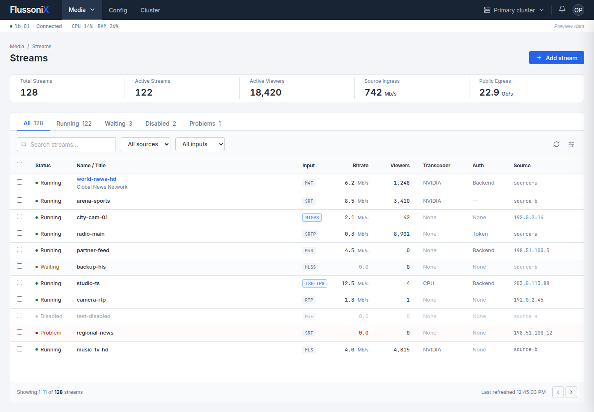
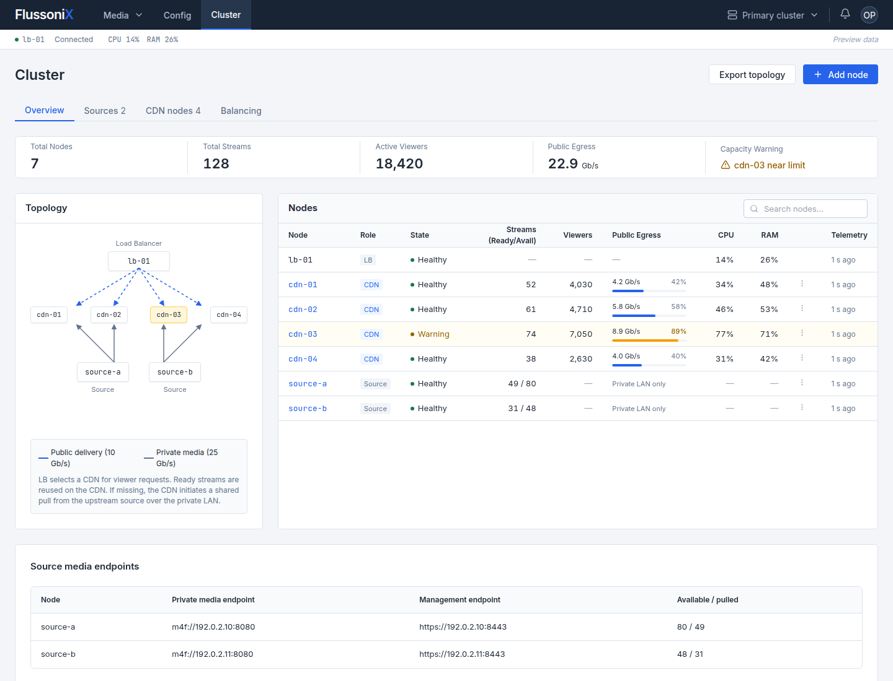

# FlussoniX UI review

Status: UI design only. Created in Superdesign using the approved interface brief. Work stopped at this review stage; no streaming runtime or deployment was performed.

[Open the Superdesign canvas](https://superdesign.dev/teams/15f3fae1-892a-4ddd-a722-9ac896abd906/projects/ceb4b61a-ec9d-449c-85f7-b2fd2ec9263d)

| Screen | Preview | Saved version |
| --- | --- | --- |
| FlussoniX Streams | [Open preview](https://p.superdesign.dev/draft/6732e128-ffa2-418a-8fe9-1968dc60b473) | 4 |
| Stream details | [Open preview](https://p.superdesign.dev/draft/6a5fc3a8-3ff1-49fe-a8ef-bc8bac1c1033) | 2 |
| Templates | [Open preview](https://p.superdesign.dev/draft/97df4c4e-2d8e-4534-8db2-9c415b908428) | 2 |
| Config Listeners TLS | [Open preview](https://p.superdesign.dev/draft/5f4b40b9-e864-4f19-a94b-3b240bdb5a0c) | 2 |
| Cluster Overview | [Open preview](https://p.superdesign.dev/draft/d88c6d79-6e64-4e9c-ba58-30527d6e1d7f) | 2 |
| Cluster Balancing | [Open preview](https://p.superdesign.dev/draft/b51e0d25-d957-414f-a710-2cdc8aac625f) | 2 |

The design uses a compact light workspace, dark horizontal navigation, dense operational tables and blue actions. It is Flussonic-inspired, with original FlussoniX branding; it is not a verified pixel-for-pixel reproduction.

Streams includes search/status filters and an Add stream drawer. Stream details includes CPU/GPU rendition controls and preview tabs for Overview, Input, Output, Auth and Diagnostics. Input and output selectors include HLS/HLSS, TSHTTP/TSHTTPS, M4F/M4FS, M4S/M4SS, SRT, RTSP/RTSPS and RTP/SRTP. Authentication separates viewers, publishers and peers.

Templates shows inheritance and the affected-stream review. Config includes listeners/TLS, API access, authorization backends, runtime limits and a staged configuration diff. Cluster shows the LB/CDN/source topology, public egress and private media endpoints, CPU/RAM utilization, telemetry age and a balancing explanation. All values are fictional.

Prototype scope: selected controls and navigation work locally. Some action buttons and optional settings remain visual placeholders. The previews do not configure servers, validate media compatibility, enforce authorization or execute balancing/transcoding.

Verification: all six drafts were read back after saving; inline JavaScript parses; links have unique IDs; each document has one layout root; both protocol directions and the auth panels are present. Streams at 1440×1000 and Cluster at 1440×1100 were rendered in Chromium and visually inspected. This is not a full interaction, accessibility or responsive-layout test.

The design system and resumable draft metadata are in `.superdesign/`. Reported generation cost: 186 Superdesign credits; precise follow-up corrections used the no-credit import workflow.
